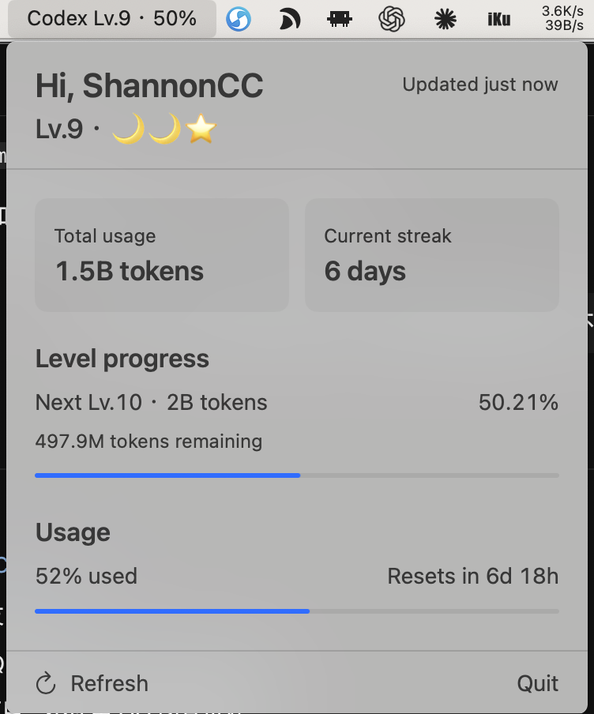

# Codex Level

Codex Level is a small macOS menu bar app that turns your lifetime Codex usage into a visible level and progress bar.

It shows:

- your Codex profile name, lifetime Token usage, and current streak;
- your current level and progress toward the next level;
- QQ-style star, moon, sun, and crown level badges;
- weekly Codex usage, reset time, and available banked resets;
- automatic refresh every minute, plus manual refresh.

## Preview



## The QQ level idea

Yes, this project is openly inspired by QQ's classic level system. The numeric level is decomposed into the familiar progression:

- ⭐ = 1 level
- 🌙 = 4 levels
- ☀️ = 16 levels
- 👑 = 64 levels

For example, Lv.9 is shown as `🌙🌙⭐`.

This is an unofficial, non-commercial fan project. It is not affiliated with or endorsed by Tencent or QQ. It uses ordinary Unicode emoji rather than QQ artwork or copied image assets. QQ and related marks belong to their respective owners.

## Requirements

- macOS 13 or later
- Swift 6
- an existing local Codex login

Codex Level reads the local Codex authentication state solely to request account data. It does not log, display, or upload access and refresh tokens.

## Run locally

```sh
swift run CodexLevel
```

Run the test suite with:

```sh
swift test
```

## Data and compatibility

Codex Level reads profile and usage information from Codex interfaces used by the local Codex experience. These interfaces may change without notice, so future Codex updates can temporarily break data loading.

The OAuth weekly-usage and banked-reset implementations were adapted from the Codex provider in [steipete/CodexBar](https://github.com/steipete/CodexBar), which is distributed under the MIT License. CodexBar deserves the credit for proving these data paths in a real macOS menu bar product. Its copyright and license notice are preserved in [THIRD_PARTY_NOTICES.md](THIRD_PARTY_NOTICES.md).

## Status

This is an early MVP. It has no cloud backend, database, analytics, third-party dependencies, leaderboard, or multi-provider support.

## License

[MIT](LICENSE)
